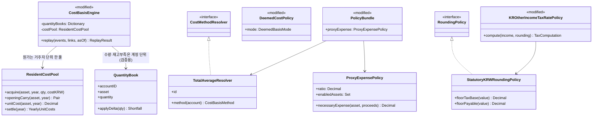
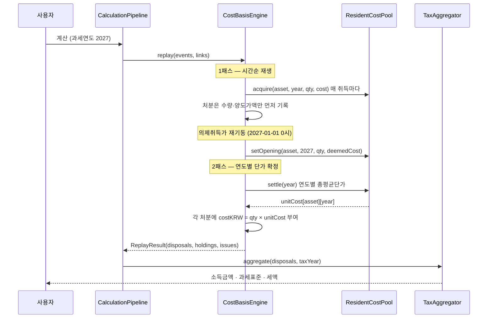
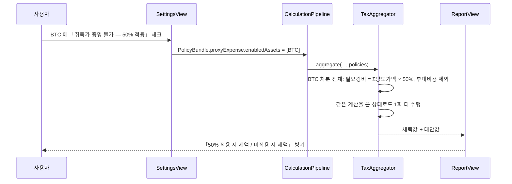
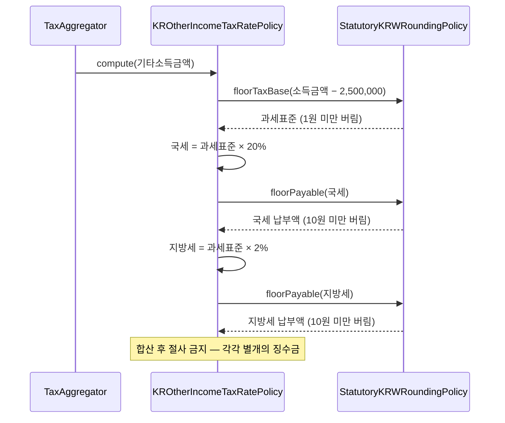

# 세법 정합성 정비 (총평균법 · 필요경비 의제 50% · 끝수 계산 · 신고 안내) — 신규 개발

> 상태: `검증중` · 갱신: 2026-08-14 · 브랜치: `feat/total-average-engine` · 다음 액션: **사람 검증(7-2) 후 main 병합**. A-1~A-3 · B · C 구현 완료, `./scripts/smoke.sh` SMOKE OK (343 tests, 0 failures). 감사 기록: [audit-2026-08-14-total-average.md](./audit-2026-08-14-total-average.md)
> 상태 단계(고정): `요구사항` → `설계` → `승인대기` → `구현중` → `검증중` → `완료`
> ⚠️ 본문의 file:line은 드리프트할 수 있음 — 실행 전 반드시 심볼명으로 재확인할 것

---

## 0. 문서 규칙 (에이전트 필독)

`~/.claude/templates/FEATURE_TEMPLATE.md` 0장 규칙을 그대로 따른다. 이 문서에만 해당하는 추가 규칙:

- **법령 근거는 백서를 인용한다.** [00-tax-law-ssot.md](./00-tax-law-ssot.md) 가 세법 SSOT 다. 이 문서에 조문 해석을 새로 쓰지 않는다. 백서와 어긋나면 백서가 맞다.
- **백서의 `[미결]` 항목을 코드에 확정값으로 넣지 않는다.** 가정을 세우면 (1) 가정 명시 (2) 사용자 고지 (3) 정책 교체 가능한 형태.

---

# Part A — 요구사항·설계 (사람 확인용)

## 1. 요구사항

- **출처**: 2026-08-13 백서 5차 검토(v1.5) 후 코드 대조. 법제처 국가법령정보 원문으로 조문 전수 확인 완료.

### 1-1. 확정 요구사항

| # | 요구사항 | 출처 | 완료 기준 (acceptance) |
|---|---|---|---|
| R1 | 취득가액을 **거주자별 총평균법**으로 계산한다 | `[영]` 소득세법 시행령 §88① (2027-01-01 시행) · 백서 6.1 | 같은 코인을 여러 계정에 나눠 보유해도 **하나의 평균 단가**가 나오고, 그 단가는 **과세기간(1/1~12/31) 단위**로 산출된다 |
| R2 | 총평균 단가는 **과세기간 종료 후** 확정된다 | `[영]` §92②4 · 백서 4.4 예시 B | 12월에 추가 매수하면 같은 해 1월 처분의 필요경비가 **소급해서** 바뀐다 |
| R3 | 계정 자료가 누락되면 **전체 세액이 틀린다**는 것을 사용자가 안다 | R1 의 직접 귀결 | 계정·기간 누락 경고가 「그 계정만 틀림」이 아니라 「전체가 틀림」으로 표시된다 |
| R4 | 취득가액 확인이 곤란하면 **총양도가액의 50%** 를 필요경비로 쓰는 경로를 제공한다 | `[법]` §37⑥ · `[영]` §88④⑤ · 백서 5.4 | 대상 자산에 대해 켜면 그 **같은 종류 전체**의 필요경비가 총양도가액×50% 로 바뀌고 **부대비용은 산입되지 않는다**. 끄면 현행 계산 |
| R5 | R4 는 **선택**이며 켰을 때·껐을 때 세액을 함께 보여준다 | §37⑥ "할 수 있다" | 두 값이 리포트에 나란히 표시되고, 어느 쪽을 채택했는지 export 에 기록된다 |
| R6 | **과세표준**은 1원 미만을 버린다 | `[법]` 국고금 관리법 §47② | 기타소득금액 12,345,678.9 → 과세표준 9,845,678 (250만 공제 후, 소수점 버림) |
| R7 | **납부할 세액**은 국세·지방세를 **각각** 10원 미만 버린다 | `[법]` 국고금 관리법 §47① · 지방세기본법 §59 | 국세 9,845,678×20%=1,969,135.6 → **1,969,130**, 지방세 …×2%=196,913.56 → **196,910**. 합산 후 절사 금지 |
| R8 | 세액이 0원이어도 **신고 대상**임을 알린다 | `[법]` §73①8 · 백서 4.3 · U-23 | 세액 0원 화면에 "신고 의무는 남는다"가 표시되고, "신고 불필요"로 읽히는 문구가 없다 |
| R9 | **지방소득세는 위택스에 따로** 신고·납부함을 알린다 | 백서 U-20 · 지방세기본법 체계 | 지방소득세 금액 옆에 별도 신고 경로가 안내된다 |
| R10 | **언제 어디에** 신고하는지 알린다 | `[법]` §70① · 백서 4.3 | "2027년분 → 2028년 5월 1~31일, 홈택스"가 리포트·완료 화면에 표시된다 |
| R11 | **Earn·렌딩 수익은 계산에 포함되지 않았음**을 알린다 | `[법]` §21①27("양도 또는 **대여**") · 백서 U-06 | 고지 문구에 명시되고, 「세무 확인」 항목에 대여소득이 추가된다 |
| R12 | 원가법 고지가 **현행 법령과 다르게 계산 중**임을 사실대로 말한다 | 백서 6.3 · 13장 I-1 | R1 구현 전까지 "총평균법으로 바뀔 가능성"이 아니라 "확정된 법령과 다름"으로 표기 |
| R13 | 「세무 확인」 항목이 백서 12장(U-01~U-24)과 대조된다 | 백서 13장 I-11 | 앱 목록에 U-03·U-04·U-06·U-07·U-08·U-12·U-13·U-16·U-20·U-21·U-22·U-23·U-24 에 대응하는 항목이 있거나, 없는 이유가 문서에 남는다 |

### 1-2. 미확정 요구사항 (사용자 확인 필요 → 9장과 연동)

| # | 항목 | 확인할 내용 |
|---|---|---|
| U1 | 의제취득가 비교 방식 `perLot` 의 존치 | 총평균법에는 매입 건(lot) 개념이 없어 설정 자체가 성립하지 않는다 → Q1 |
| U2 | 전송 소실 수량의 원가 처리 | 풀이 하나가 되면 "폐기"와 "잔존"의 의미가 달라진다 → Q2 |
| U3 | 2027 이전 연도의 계산 방법 | 그 시기엔 소득 구분 자체가 없었다. 기초 재고 원가를 뽑는 방법을 무엇으로 볼지 → Q3 |

## 2. 스코프

### In

- **A-1** 거주자별 총평균법 (R1·R2·R3)
- **A-2** 필요경비 의제 50% (R4·R5)
- **A-3** 끝수 계산 (R6·R7)
- **C** 백서 마무리 — 국세청 고시 원문 확보, 곁가지 조문 대조, 미결 목록 정합 (R13)
- **B** 신고 안내·고지 문구 (R8·R9·R10·R11·R12)

### Out (명시적 비목표)

- **스테이킹·에어드롭·하드포크·토큰스왑의 과세 기준** — 2026-10 국세청 고시 대기 (백서 11장). 지금 추측해 구현하지 않는다
- **대여(Earn·렌딩) 소득의 계산** — 시행령에 계산 규정이 없다 (백서 U-06). R11 은 "포함 안 됨을 알린다"까지만
- **가산세·부과제척기간·체납 압류·분납 안내** — 정상 신고 흐름 밖 (백서 4.5·9.5·U-21). 사용자 판단으로 제외
- **비거주자·법인 계산** — 앱은 거주자 전용
- **선물·마진** — 조문 없음 (백서 I-10)
- **NFT 판정** — 개별 판단 (백서 U-07)

## 3. 설계

### 3-1. 클래스 다이어그램

### 3-2. 시퀀스 다이어그램

**시나리오 1: 총평균법으로 한 해 세액을 계산한다 (R1·R2)**

**시나리오 2: 취득가 증명이 안 되는 코인에 50% 의제를 켠다 (R4·R5)**

**시나리오 3: 끝수 계산 (R6·R7)**

### 3-3. 설계 결정 표

| # | 항목 | 채택안 | 근거 | 폐기 대안 + 폐기 이유 |
|---|---|---|---|---|
| D1 | 장부 구조 | **수량 장부는 계정별 유지, 원가는 거주자별 단일 풀로 분리** | `[영]` §88① 은 *원가 계산 단위*만 거주자별로 정한다. 계정별 수량 추적은 전송 누락·재고 부족 감지(V-QTY/V-COST)에 그대로 필요하다 | 계정별 장부를 통째로 없애기 — 재고 부족 검증이 사라져 자료 누락을 못 잡는다 |
| D2 | 단가 산출 시점 | **과세기간 단위 2패스** (1패스 누적 → settle → 2패스 원가 부여) | `[영]` §92②4 의 총평균법 정의가 「기초 + 당기취득 ÷ 총수량」이라 연말 전에는 확정 불가 | 처분 시점 즉시 확정(현행) — 법과 다른 값이 나온다 |
| D3 | 기말 → 다음 해 기초 | **잔여수량 × 그해 총평균단가** 를 다음 해 기초 취득가액으로 이월 | §92②4 가 「과세기간 종료일 현재 재고자산의 가액을 평가하는 방법」이라고 명시 | 원가 잔액을 그대로 이월 — 수량과 단가가 어긋난다 |
| D4 | 2027 이전 연도 | **같은 총평균법으로 재생** (기초 원가 산출 목적) | 2027-01-01 기초 재고의 「실제 취득가액」이 있어야 §37⑤ max 비교가 된다. 방법을 하나로 두는 편이 설명 가능하다 → **Q3 확인 필요** | 기존 계정별 이동평균/FIFO 유지 — 한 앱 안에 두 체계가 공존해 검증·설명이 불가능해진다 |
| D5 | 전송 소실 수량의 원가 | **폐기 유지 (`abandon_lost_cost`).** 단일 풀에서는 기본 동작이 "원가 잔존"이 되므로 **명시적으로 차감**한다 | 이미 고지된 정책(TaxCopy.transferCost)이고, 근거 없이 세액이 줄어드는 쪽으로 바꾸지 않는다. **Q2 승인 완료.** 10월 고시 재조사 대상으로 백서 U-10·11.1 에 등재 | 원가 잔존(단가 상승) — 세액이 줄어드는 방향인데 공개 기준이 없다 |
| D6 | 의제취득가 비교 단위 | **`positionAverage` 단일화, `perLot` 제거** | 총평균법에는 매입 건(lot) 개념이 없다. §37⑤ 를 자산별 평균 단가와 시가로 비교하는 것이 유일하게 성립하는 독해. **Q1 승인 완료** | perLot 유지 — 계산할 lot 이 존재하지 않아 설정이 무의미해진다 |
| D7 | 50% 의제 적용 단위 | **자산(종류)별 on/off**, 그 자산의 **해당 과세연도 처분 전체**에 일괄 | `[법]` §37⑥ "같은 종류의 가상자산 전체" | 처분 건별 선택 — 조문이 건별 선택을 배제한다 |
| D8 | 50% 의제 대상 기간 | **2027-01-01 이후 취득분이 있는 자산만 후보**로 노출하고, 적용 시 그 자산 전체 양도가액에 50% | `[법]` §37⑥ 요건은 2027 이후 취득분, 효과는 "같은 종류 전체" — 두 범위가 어긋난다(백서 U-24). **어긋남을 화면에 고지**하고 사용자가 고르게 한다 | 앱이 한쪽으로 단정 — 확정 해석이 없다 |
| D9 | 끝수 | **과세표준 1원 버림 / 국세·지방세 각각 10원 버림**, 반올림 폐기 | `[법]` 국고금 관리법 §47①② · 지방세기본법 §59 | 현행 1원 반올림 유지 — 신고서 금액이 국세청 계산과 어긋난다 |
| D10 | 정책 번들 id | 총평균법 전환 시 `cointax-v2` 로 올린다 | 과거 스냅샷과 계산 결과가 달라지므로 구분 가능해야 한다 (design/04-policies §1) | v1.x 유지 — 어느 규칙으로 계산한 숫자인지 사후 판별 불가 |

### 3-4. 경계 영향

- 프로세스 간 통신: 아니오 (단일 앱)
- 공통 모듈: **예** — `PolicyBundle`(정책 조립), `RoundingPolicy`(끝수), `CostMethodResolver`(원가법)
- 공유 데이터 모델: **예** — `DisposalRecord.costKRW`·`method`, `HoldingsRow`, `DeemedPosition`, `TaxYearSummary`. 저장된 과거 계산 스냅샷과 값이 달라지므로 D10(번들 id) 로 구분한다

## 4. 참조 패턴 (기존 구현 미러링 지정)

| 만들 것 | 미러링할 기존 구현 (절대경로 + 심볼) | 따라야 할 점 |
|---|---|---|
| `TotalAverageResolver` | `/Volumes/SourceCode/Sample/CoinTax/CoinTax/Domain/Policies/CostMethodResolver.swift` — `VASPMAElseFIFOResolver` | `id` 문자열 보유, `Sendable`, 계정을 받아 method 반환하는 시그니처 유지 |
| `ProxyExpensePolicy` | 같은 디렉터리 — `DeemedCostPolicy` / `MaxBookMarketDeemedPolicy` | 프로토콜 + 구현체 + `id`, 설정은 `DeemedPreferences` 처럼 `UserDefaults` 래퍼로 분리 |
| `StatutoryKRWRoundingPolicy` | `/Volumes/.../Domain/Policies/RoundingPolicy.swift` — `PlainKRWRoundingPolicy` | 기존 `RoundingPolicy` 프로토콜을 확장(메서드 추가)하고 구현체 교체. 프로토콜을 새로 만들지 않는다 |
| `ResidentCostPool` | `/Volumes/.../Domain/CostBasis/AssetBook.swift` — `MovingAverageBook` | Decimal 나눗셈 최소화(전량 처분 시 잔여 원가 그대로), `Money.isApproxZero` 로 0 수렴 처리 |
| 50%/현행 병기 표시 | `/Volumes/.../Features/Report/ReportView.swift` — `deemedAlternative` 표시 블록 (`alt.totalTaxKRW` 비교 UI) | 채택값·대안값·차액을 같은 형태로 보여주고 근거 문구를 병기 |
| 신고 안내 문구 | `/Volumes/.../Domain/Policies/TaxCopy.swift` — `notices` | 잠금된 필수 고지 4종은 건드리지 않고 `notices` 쪽에 추가 |
| 「세무 확인」 항목 추가 | `/Volumes/.../Domain/Policies/TaxOpenQuestions.swift` — `TaxOpenQuestion` | `id`/`kind`/`weight`/`currentAssumption`/`whatToAsk`/`impact`/`basis`/`switchPoint` 전 필드 채움 |

> **`승인대기`**: Part A 완성. 9장 Q1~Q3 결정 후 `구현중` 전환 + Part B 작성.

---

# Part B — 작업 지시 (AI 실행용)

## 5. 구현 계획 (Phase)

> 사용자 승인 후 작성.

| Phase | 목적 | 포함 WO | 완료 판정 |
|---|---|---|---|
| 1 | A-3 끝수 | WO-1 `[x]` | 손계산 골든 통과 · 커밋 `2fc4c2b` |
| 2 | A-1 총평균법 — 원가 풀 코어 | WO-2 `[x]` | 13 케이스 통과 · 커밋 `fe48571`·`6a0395d` |
| 3 | A-1 총평균법 — 재생이 풀에 수집 | WO-3 `[x]` | 338 tests 0 failures · 커밋 `8bd8497` |
| 4 | A-1 총평균법 — 결과를 풀로 전환 | WO-4 `[x]` | 골든 46건 전부 손계산으로 설명 후 갱신 |
| 5 | A-2 50% 의제 | WO-5 `[x]` | 손계산 6건 · 검증기 대응 |
| 6 | C 백서 마무리 | WO-6 `[x]` | §57·§97 원문 대조 · 「세무 확인」 19 → 28건 |
| 7 | B 신고 안내 | WO-7 `[x]` | 화면·PDF·CSV 동일 문구 · 회귀 7건 |

## 6. 작업 지시서 (Work Orders)

### WO-1: 끝수 계산을 국고금 관리법 §47 에 맞춘다
- 상태: `[x]` 완료 (2026-08-13)
- 의존: 없음
- 충족: R6, R7
- 대상: `RoundingPolicy.swift` · `TaxRatePolicy.swift` · `PolicyBundle.swift` · `Verifier.swift` · `TaxOpenQuestions.swift`(TQ-03)
- 변경한 것:
  1. `RoundingPolicy` 프로토콜에 `floorTaxBaseKRW`(1원 버림)·`floorPayableKRW`(10원 버림) 추가
  2. `PlainKRWRoundingPolicy` → **`StatutoryKRWRoundingPolicy`** 로 교체 (id `statutory_krw_gfma_47`). 비유한 값은 0 으로 접어 `V-NUM-01` 이 잡게 둔다
  3. `KROtherIncomeTaxRatePolicy.compute` — 과세표준 1원 버림, 국세·지방세 **각각** 10원 버림
  4. `Verifier` 의 기대값 재계산도 같은 함수로 교체 — **반올림으로 검사하면 법대로 계산한 값을 Critical 로 막는다**
  5. TQ-03 을 `.needsConfirmation` → `.confirmed` 로 내리고 근거를 조문으로 교체
- 금지: `Money.roundKRW` 자체의 의미 변경 금지 (단가·표시에서 쓰인다) — 지키됨
- 완료 판정: `OracleTaxPathTests.testG_statutoryRounding` 통과 + 전체 회귀 0 실패

### WO-2 / WO-3: 원가 풀 코어 + 재생 수집
- 상태: `[x]` 완료 (2026-08-13, 커밋 `fe48571` · `6a0395d` · `8bd8497`)
- 충족: R1 의 계산 코어. **아직 세액에 반영되지 않는다** — 결과는 여전히 계정별 장부에서 나온다
- 만든 것: `ResidentCostPool` (연도별 총평균단가·이월·폐기·수수료 원가 수렴), 재생 8개 지점의 수집 호출

### WO-4: 결과를 풀로 전환 ← **다음 작업, 이것 하나만 집는다**
- 상태: `[ ]` 대기
- 의존: WO-3 완료
- 충족: R1, R2, R3
- 대상: `CostBasisEngine.replay` 후반부 · `PolicyBundle` · `Identifiers.swift` · `TaxCopy` · `Verifier`
- 변경:
  1. **정산 2단계** — `process(pass1)` 뒤에 `pool.settle(years: [최소연도...2026])`, 의제 재기동 뒤에 `process(pass2)` 다음 `pool.settle(years: [2027...최대연도])`. 각 단계에서 **수수료 원가를 3회 수렴**시킨다 (`feeIntoAcquisition` → `pool.setDerivedAcquisitionCost` → `settle` 반복)
  2. **의제 재기동을 자산 단위로** — 단가는 `pool.unitCost(asset, 2026)`, 시가와 max 비교 후 `pool.setOpening(asset, 2027, 총수량, 총수량 × 의제단가)`. `DeemedPosition` 은 **계정별로 계속 발행**하되 `bookUnitKRW`/`deemedUnitKRW` 는 자산 단위 값을 넣는다 → 모델·Verifier(V-DEM-01)·UI 를 건드리지 않는다
  3. **처분 원가 패치** — `disposals` 를 순회하며 `costKRW = pool.costOfDisposal(asset:year:qty:)`, `feesKRW` 는 기록해 둔 (수수료자산, 수량)에 단가를 곱해서, `pnlKRW` 재계산, `method = .totalAverage`
  4. **소실 원가 패치** — `abandonedTotal`/`abandonedByYear` 를 `pool.abandonedCostByYear()` 로 교체
  5. **보유 스냅샷** — `HoldingsRow.averageUnitKRW`/`totalCostKRW` 를 풀 단가 기준으로
  6. `CostBasisMethod` 에 `.totalAverage` 추가, `TotalAverageResolver` 신설, `PolicyBundle.id` → `cointax-v2`
  7. `TaxCopy.costMethods` 를 「거주자별 총평균법」으로 (R12 — 지금은 "빗썸=이동평균" 이라고 적혀 있다)
- 금지: `books` 의 수량·재고부족 로직(V-QTY-02 등)에 손대지 말 것 — 계정 자료 누락 탐지가 사라진다
- 완료 판정: 전체 회귀에서 깨진 골든을 **하나씩 손계산으로 설명**한 뒤 갱신. 설명 안 되는 게 하나라도 있으면 중단하고 9장에 올린다

## 7. 검증 계획

> 승인 후 작성.

### 7-1. 에이전트 검증

- [x] 빌드: `xcodebuild -scheme CoinTax -destination 'platform=macOS,arch=arm64' -derivedDataPath /tmp/cointax-dd CODE_SIGNING_ALLOWED=NO build-for-testing` — 결과: **TEST BUILD SUCCEEDED**
- [x] 전체 회귀: `xcodebuild -xctestrun … -only-testing:CoinTaxTests -parallel-testing-enabled NO test-without-building` — 결과: **Executed 325 tests, with 0 failures**
- [x] 끝수 골든 (R6·R7): `OracleTaxPathTests.testG_statutoryRounding` — 결과: 통과. 과세표준 9,845,678 / 국세 1,969,130 / 지방세 196,910 / 합 2,166,040. 각각 절사와 합산 후 절사가 갈리는 케이스(3,500,049)도 고정
- [x] 회귀로 드러난 골든 갱신 — 결과: `GoldenG1bTests` 지방세 147,228 → **147,220**, `RealDataTests` 과세표준 소수점 버림·세액 10원 버림 3건. 전부 법 변경의 직접 결과이며 갱신 후 통과

### 7-2. 사람 검증

- [ ] R7: 소득 12,345,678원 → 국세 1,969,130 · 지방세 196,910 으로 **화면에** 표시되는가 (7-1에서 계산 계층은 기계 검증됨)

## 8. 주의사항 (누적)

- **가상자산 조문은 대부분 2027-01-01 시행예정**이다. 법제처에서 현행 본문만 조회하면 "그런 조문 없음"이 나온다. 반드시 시행일(`efYd=20270101`)을 지정한다. 현행 소득세법 시행령 §88 은 `삭제` 상태다
- `PolicyBundle.v1Default.disclaimers`(필수 고지 4종)는 **골든 테스트에 잠겨 있다.** 개수·순서·문구를 바꾸면 테스트가 깨지므로, 바꿀 때는 정책 번들 id 를 함께 올린다 (`TaxCopy.all` 주석)
- 의제취득가 재기동(`b.replaceLots`) 직후 `V-DEM-03` 이 총원가 일치를 Critical 로 검사한다. 단가 나눗셈을 한 번 더 태우면 소수 자릿수 한계로 정상 계산이 막힌다 (`CostBasisEngine.swift` 의 `deemedUnit` 주석 참조)
- `MovingAverageBook.disposeClamped` 는 **전량 처분 시 잔여 원가를 그대로** 쓴다. 새 풀 구현에서도 같은 회피를 해야 18자리 수량에서 원가가 남지 않는다

---

## 9. 미결 사항 (사용자 결정 필요 — 에이전트 임의 결정 금지)

| # | 질문 | 배경 | 결정 (사용자 기입) |
|---|---|---|---|
| Q1 | 의제취득가 비교 방식에서 **「매입 건별」 설정을 없애도 되는가** | 지금 설정 화면에 「보유 전체 평균 / 매입 건별」 선택이 있다. 총평균법에는 매입 건 개념 자체가 없어져 「매입 건별」이 계산 불가능해진다. 없애면 기존 사용자 설정이 사라진다 (백서 U-09·I-4) | **결정 (2026-08-13): 제거.** "법에 맞게 수정하는 거면 그렇게 해" → D6 확정 |
| Q2 | 전송 중 소실된 수량의 **취득원가를 지금처럼 버릴 것인가** | 현행은 "보수적 폐기"(세액이 커지는 방향)이고 이미 고지돼 있다. 풀이 하나가 되면 「원가를 남기고 단가를 올리는」 처리가 **기본 동작**이 되고, 폐기하려면 일부러 깎는 코드를 넣어야 한다. 그러면 세액이 줄어든다. 공개된 기준은 없다 (백서 U-10·TQ-07) | **결정 (2026-08-13): 버리는 쪽 유지 + 10월 고시 재조사 대상으로 백서에 등재.** 근거 없이 세액이 줄어드는 쪽으로 바꾸지 않는다. 총평균법 전환 후에도 같은 결과가 나오도록 **명시적으로 차감**한다 → D5 확정. 백서 U-10·11.1 에 기록 (v1.6) |
| Q3 | **2027년 이전 거래도 총평균법으로** 재생할 것인가 | 2026년까지는 소득세법에 가상자산소득이라는 구분 자체가 없었다(백서 3.1). 그런데 2027-01-01 기초 재고의 「실제 취득가액」을 알아야 §37⑤ 의 max 비교가 된다. 그 값을 뽑는 방법을 총평균법으로 통일할지, 기존(계정별 이동평균/FIFO)을 남길지 | **결정 (2026-08-13): 총평균법으로 통일.** "27년 되기 전에도 테스트 겸 계산해 봐야 하니까 동일하게" → D4 확정. 과세 시작 전 연도의 예상 계산도 같은 규칙으로 나온다 |

## 10. 작업 로그 (append-only)

### 2026-08-13 — 세션 (백서 v1.5 검토 직후)
- 한 일: 백서 v1.5 기준으로 코드 대조 → 요구사항 R1~R13 확정, 스코프 확정(가산세·압류·분납은 사용자 판단으로 Out), Part A(1~4장) 작성
- 알아낸 것:
  - 원가 장부가 `books[accountID][assetCode]` 로 **계정×자산** 단위 (`CostBasisEngine.swift` `book(for:asset:)`) — 법령의 「거주자별」과 계산 단위가 다르다
  - 총평균법은 연말에 단가가 확정되므로 **현행 1패스 구조로는 표현 불가** → 2패스 설계(D2)
  - 계정별 장부를 없애면 재고 부족·전송 누락 검증이 함께 사라진다 → 수량/원가 분리(D1)
  - 끝수는 국세·지방세가 **각각** 10원 절사 (지방세기본법 §59 가 국고금 관리법 §47 을 준용). 합산 후 절사는 틀림
  - §37⑥ 은 요건(2027 이후 취득분)과 효과(같은 종류 전체)의 범위가 어긋난다 → 앱이 단정하지 말고 고지 후 선택(D8)
- 바뀐 결정: 없음 (최초 작성)

### 2026-08-13 — WO-1 구현 (A-3 끝수)
- 한 일: `StatutoryKRWRoundingPolicy` 도입, 세율 정책·검증기 교체, TQ-03 고지 갱신, 골든 4곳 갱신. 빌드·전체 회귀(325 tests, 0 failures) 통과
- 알아낸 것:
  - `Verifier` 가 세액을 **독립적으로 재계산**해 대조한다(`Verifier.swift` V-TAX-02/03/04). 정책만 바꾸고 검증기를 안 바꾸면 **법대로 계산한 값이 Critical 로 막혀 export 가 잠긴다.** 반드시 짝으로 고친다
  - `GoldenG1bTests`·`RealDataTests` 가 기대값을 `Money.roundKRW` 로 **재유도**하고 있었다. 규칙을 바꾸면 테스트가 옛 규칙을 그대로 재현해 실패한다 — 기대값을 정책 함수로 바꿔야 규칙 변경이 테스트에 반영된다
  - 과세표준이 10원 이하인 구간(예 10원)에서는 국세·지방세가 **둘 다 0원**이 된다. 예전 반올림에서는 2원이 남았다
- 바뀐 결정: 없음

### 2026-08-13 — WO-2·WO-3 구현 (총평균법 코어 + 수집)
- 한 일: `ResidentCostPool` 신설(13 케이스) → 수수료 원가 수렴 추가 → 재생 8개 지점에서 풀에 수집. 매 단계 전체 회귀 통과(325 → 338 tests, 0 failures). 세 번 커밋·푸시
- 알아낸 것:
  - **코인으로 낸 수수료가 취득원가에 더해지면 단가가 서로를 참조할 수 있다.** BNB 로 BTC 수수료를 내고 BTC 로 BNB 수수료를 내는 경우. 풀에 `derivedAcquisitionCost` 버킷을 두고 `settle` 을 반복해 수렴시킨다 (수수료는 거래액의 0.1% 수준이라 2~3회면 1원 미만)
  - **자기 계정 간 전송은 원가를 옮기지 않는다.** 같은 풀 안의 이동이라 수량만 움직인다. 네트워크 수수료로 사라진 몫만 폐기한다 — `[영]` §92②4 의 기말평가(평균단가 × 기말수량)를 그대로 따르면 그 원가가 회수되지 않으므로, **현행 폐기 정책이 조문 계산식과도 맞는다**. 백서 U-10 을 이 내용으로 정정했다 (v1.6)
  - 수수료를 풀에 넘길 때는 계정 장부가 모자라도 **전량**을 넘긴다. 계정 장부의 클램프는 그 계정 이야기이고, §88① 은 사람 단위다
- 바뀐 결정: 없음

### 2026-08-13 — WO-4 진행 (결과를 풀로 전환) · 브랜치 `feat/total-average-engine`
- 한 일: 정산 2단계 + 수수료 원가 수렴, 의제 재기동을 자산 단위로 재작성, 처분 원가·부대비용·소실 원가·보유 스냅샷을 풀 단가로 교체, `CostBasisMethod.totalAverage`·`TotalAverageResolver`·번들 id `v2.0`·원가법 고지 문구 교체. Trezor Suite 파서 신설
- 작업 중 **내가 만든 회귀 세 개**를 원가 보존 테스트로 잡았다 (실패 208 → 51):
  1. 풀이 **가진 것보다 많은 원가를 내줬다.** 자료가 빠져 판 수량이 산 수량을 넘으면 없는 원가가 공제된다 → 가진 원가만큼만 배분하도록 잘랐다
  2. **원화 수수료가 풀에 안 들어갔다.** 매수 때 낸 원화 수수료가 취득원가에서 빠져 거래마다 조금씩 샜다
  3. **2027 거래가 없으면 의제취득가가 증발했다.** 정산 연도를 「거래가 있는 해」로만 잡아서, 재기동해 둔 취득가를 아무도 읽지 않았다
- **정정** — 커밋 `010e86d` 의 메시지가 3번을 "지금은 모든 이용자에게 해당" 으로 적어 **출시된 결함처럼** 읽힌다. 사실이 아니다. `main` 은 의제 단가로 **계정 장부 자체를 재기동**하고(`replaceLots`) 보유 스냅샷이 그 장부를 읽으므로 2027 거래 유무와 무관하게 정상이다. 3번은 **원가를 장부에서 풀로 옮기면서 이 브랜치 안에서 생긴 회귀**이고, 합치기 전에 잡았다
- 확인한 것: 요청받은 「2026 년에도 예상 세액을 본다」 기능은 그대로다. 시가가 없으면 경고만 띄우고 실제 산 값으로 계산하는 분기(`TaxTime.isBeforeTaxStart`)를 새 코드에 그대로 옮겼고, `PreTaxStartEstimateTests` 가 통과 중이다. 2026 예상 세액은 2026 단가를 쓰므로 이번 수정의 영향을 받지 않는다
- 남은 것: 「정상 시나리오에서 Critical」 2건 조사 → 총평균법으로 달라진 골든 6건 손계산 → 근거 확실한 16건 갱신

### 2026-08-14 — WO-4~WO-7 완료
- 한 일: 결과를 풀로 전환하고 골든 46건을 근거를 대며 갱신. 「매입 건별」 제거. 필요경비 의제 50%(§37⑥) 신설. 신고 안내(§73①8·U-20·§70①·U-06) 추가. 백서 남은 조문(§57·§97) 대조. 「세무 확인」을 백서 12장과 맞춰 19 → 28건
- **이번 회차에 잡은 결함 8건** — 상세는 [audit-2026-08-14-total-average.md](./audit-2026-08-14-total-average.md). 전부 엔진 밖 검증 장치가 잡았고, 기존 테스트는 전부 통과하는 상태였다
- 확인했고 문제 없던 범위: 나눗셈 값 `==` 비교(3곳 모두 의도된 가드) · 화면/파일/저장 왕복(기존 테스트가 덮음) · 무작위 생성기 범위(이미 넓혀져 있음)
- 살린 것: 바이낸스 외부 정답지가 없어 검증이 **조용히 skip** 되고 있었다 — 재생성했다
- 남은 것: 디파이 예치 원가 이어주기(U-05 대기) · UI 실행 검증 · 국세청 고시 원문(U-14) · 2026-10 고시(백서 11.1)
- 바뀐 결정: 없음

